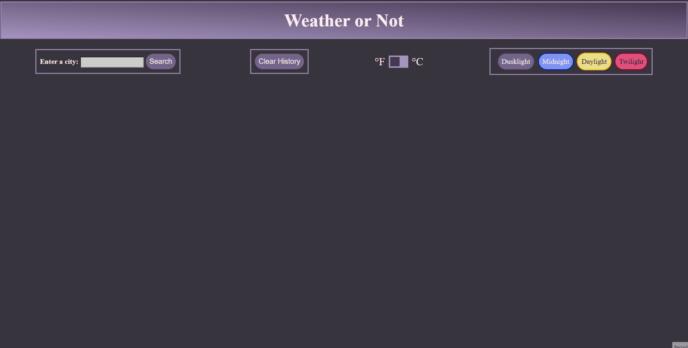
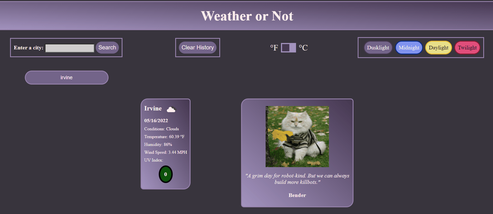
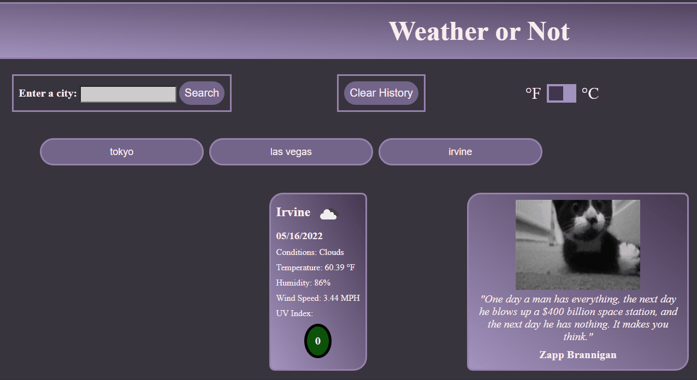
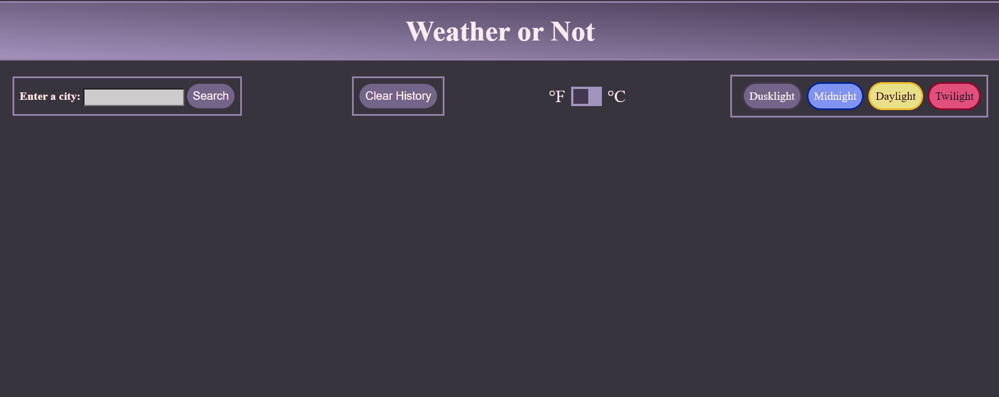
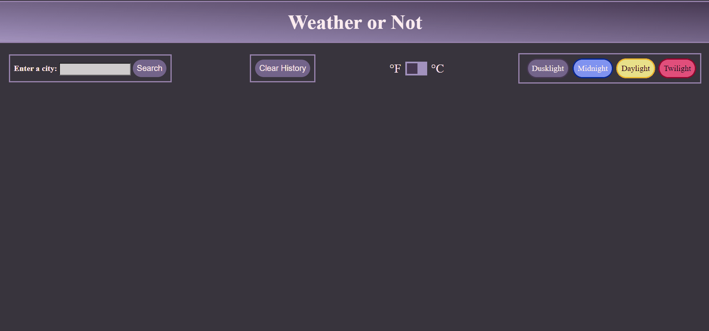

# Weather_Dashboard
An app designed to show weather outlook of various locations upon user request by fetching data from a weather API. Upon search, the user will be presented with the current day's weather outlook and a forecast for the next five days

Weather Dashboard deployed [here](https://swagnarok630.github.io/Weather_Dashboard/)

## Criteria

* We want to present the user with an input field to enter a city
  * If the user inputs an invalid city name or an empty field, nothing happens
  * A valid city name will be entered into a history list
    * History list is set to a max of 10 cities shown
    * For every city past 10, the oldest search will be removed and the newest added to the list
* When a city is searched, the current weather for the city is shown, along with a 5-day forecast
  * Weather data returned is as follows:
    * City Name
    * Date
    * An icon representing weather conditions
    * Temperature
    * Humidity
    * Wind Speed
    * UV Index
      * When UV index is shown, value will visibly reflect if conditions are favorable, moderate, or severe
  * Weather data for forescast is as follows:
    * Date
    * An icon representing weather conditions
    * Temperature
    * Humidity
    * Wind Speed
* Cities listed in the history list can be clicked on to pull data again

## Bonus Features

* Multiple theme buttons to change the look of the dashboard. Themes set will persist through page refresh
  * 
* A button to clear the search history. Dynamically deletes history without refreshing page
  * 
* Imperial vs Metric units toggle, when set, will define the units that the data will fetch
  * 
* Random Futurama quote to be attached to every weather search, just for fun
* Random cat picture to be attached to every weather search, just for fun
  *  

## Notes
Most of the features and goals for this app have been achieved. Only a couple of possible future features come to mind
### Future Features
* Perhaps a cross reference with the geocode API to specify State/Country of city to allow more accurate searches could be implements. 
* Allow a way to dynamically change the forecast cards units of measurement, as they currently only change when a fetch is made, not when the toggle is switched
* Have icons set for each theme and change depending on the theme used
